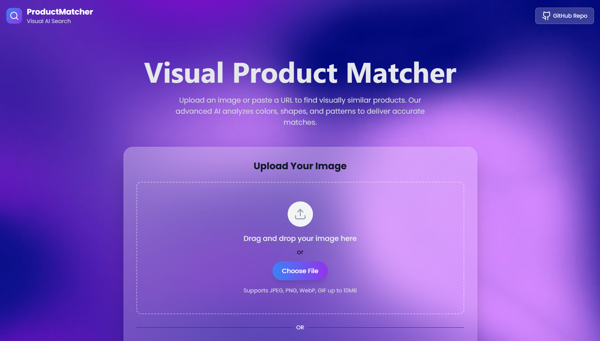

# 🖼️ Visual Product Matcher

A sophisticated web application that helps users discover visually similar products using **AI-powered image recognition**.  
Upload an image or provide a URL to instantly find matching products from a curated database.


<p align="center">
  
</p>

---

## ✨ Features

- 🖼️ **Dual Input**: Upload images (drag-and-drop) or paste an image URL  
- 🤖 **AI Recognition**: Powered by [Imagga API](https://imagga.com/) for color extraction, tagging, and similarity detection  
- 🔍 **Smart Filtering**: Filter results by similarity threshold, category, and price  
- 📱 **Responsive UI**: Optimized for desktop, tablet, and mobile devices  
- ⚡ **Fast Performance**: Built with **React 18**, **Vite**, and client-side optimizations  
- 🎨 **Modern Design**: Glass-morphism UI, smooth animations, and Lucide icons  

---

## 📊 Visual Similarity Algorithm

The system combines **Imagga AI** with custom **client-side heuristics**:

1. **Color Analysis** (40%) → Dominant colors & RGB distance  
2. **Brightness** (20%) → Overall luminosity comparison  
3. **Aspect Ratio** (20%) → Dimensions & orientation  
4. **Tag-based Similarity** (20%) → AI-generated semantic tags vs product metadata  

---

## 🛠 Technology Stack

- **Framework**: React 18 + TypeScript  
- **Build Tool**: Vite  
- **Styling**: Tailwind CSS  
- **Icons**: Lucide React  
- **Image Analysis**: Imagga API + Canvas API  
- **Deployment**: Vercel / Netlify  

---

## 🧩 API Integration

We use the **[Imagga API](https://imagga.com/)** for image recognition.  
The following endpoints are used:

- `/colors` → Extract dominant colors  
- `/tags` → Generate semantic image tags  
- `/categorization` → AI-driven product categorization  

📖 [Imagga API Docs](https://imagga.com/docs)

---

## 📦 Installation & Setup

### Prerequisites
- Node.js **16+**  
- npm or yarn  
- Imagga API account ([Sign up here](https://imagga.com/))  

### 1. Clone the Repository
```bash
git clone https://github.com/sunscarsonys/visual-product-matcher.git
cd visual-product-matcher
```

---

## 📦 Install Dependencies

```bash
npm install
# or
yarn install
```

---

## 🔧 Configuration

### Environment Variables

Create a `.env` file at the root of the project:

```bash
# .env
VITE_IMAGGA_API_KEY=your_imagga_api_key
VITE_IMAGGA_API_SECRET=your_imagga_api_secret

For reference, see `.env.example` included in the repo:
# .env.example
VITE_IMAGGA_API_KEY=your_api_key_here
VITE_IMAGGA_API_SECRET=your_api_secret_here
```
---

## 🔧 Run the Development Server

```bash
npm run dev
# or
yarn dev
```

---

### How to Use

```markdown
## 🎯 How to Use

- **Upload an Image**: Drag and drop an image or click to browse files  
- **Or Enter Image URL**: Paste a direct image URL for analysis  
- **AI Analysis**: Our system processes the image and identifies objects  
- **Browse Results**: View similar products with similarity scores  
- **Filter & Sort**: Refine results by category, similarity, or price  
```
---

## 📁 Project Structure
```bash
src/
├── components/          # React components
│   ├── ImageUploader.tsx
│   ├── SearchResults.tsx
│   └── Header.tsx
├── services/            # API services
│   └── imageRecognition.ts
├── data/                # Static data
│   └── products.ts
├── types/               # TypeScript definitions
│   └── index.ts
├── utils/               # Utility functions
│   └── imageAnalysis.ts
└── App.tsx              # Main application component
```


---

## 📝 Assignment Details

This project was developed as a technical assessment for the Software Engineer position at Unthinkable Solutions – Daffodils.

**Requirements Fulfilled ✅**

- Image upload (file + URL input)  
- Search interface with filtering  
- Product database with 50+ items  
- Live deployment  
- Mobile responsive design  
- Clean, production-quality code  
- Error handling and loading states  
- Comprehensive documentation  

---

## 📄 License

This project is created by Sanskar Soni as an assignment for Unthinkable Solutions – Daffodils.  
All rights reserved.

---

## 👨‍💻 Developer

Sanskar Soni

- 🌐 Portfolio: [www.sunscar.dev](https://www.sunscar.dev)  
- 📧 Email: sanskarsoni663@gmail.com  
- 💻 GitHub: [@Sunscarsonys](https://github.com/Sunscarsonys)  

---

<div align="center">
Made with ❤️ by Sanskar Soni
</div>
